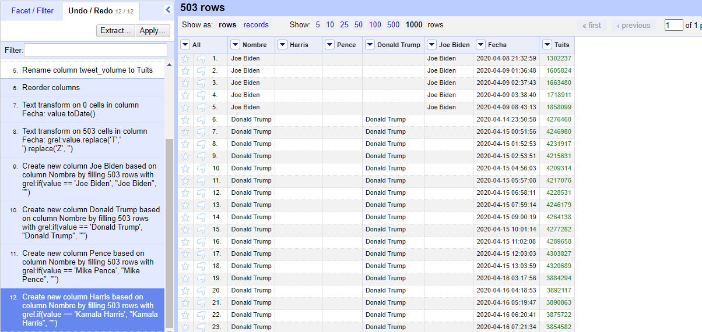
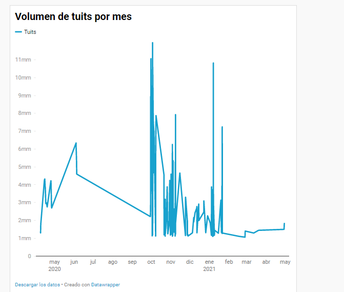

#Actividad 3
Actividad 3

Para la actividad 3 se ordenaron los datos en Open Rifen. Primeramente, reordenando las columnas por nombre, fecha y tuits y poniéndole a cada columna su formato adecuado. Además, se creó una columna por cada nombre para que todo quedase separado tal y como mostrabas en la clase.

Sin embargo, a la hora de realizar el gráfico era imposible crear uno que incluyese todos los datos, probé todas las maneras posibles, y dado que no estaba explicado en las clases, opté por crear un gráfico general en el que simplemente aparecen el número de tuits por mes. De tal forma que se puede entender por qué el mes de octubre y enero son los que más tuits tienen. En uno por las elecciones y en otro por la elección del senado.

