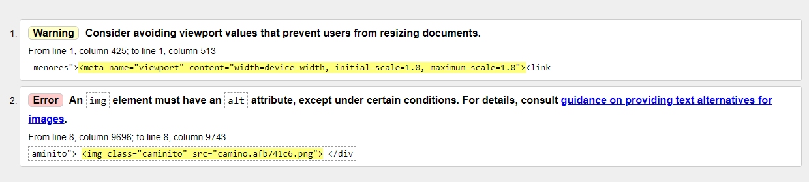

#Aixa Rodríguez Carballo

##ACTIVIDAD 2

El [artículo seleccionado](https://www.newtral.es/especiales/menores-extranjeros-no-acompanados-europa/) pertenece [Newtral](https://www.newtral.es/), una web que recoge reportajes y noticias de datos sobre diferentes temáticas. Con respecto a su diseño y usabilidad cabe destacar que es una web sencilla de utilizar, pero a la vez muy completa y dinámica. Algo muy positivo es que la portada no está repleta de información, sino que aparecen titulares separados a lo largo de toda la web que se pueden ir clicando o simplemente con pasar el cursor sobre ellos aparece una imagen detrás en relación con el tema. Además, a medida que hacemos scroll aparece un reportaje/noticia destacado de la sección y debajo otras opciones relacionadas. Cuenta también con muchas opciones en las que reparte la información, ya que hay una opción de reportajes, otra de especial, zona de verificación, nuevo, especiales, transparencia, topics, etc.

Con respecto al artículo elegido, “Menores no acompañados en Europa”, cabe destacar primeramente que la url de acceso es simple y correcta:

<https://www.newtral.es/especiales/menores-extranjeros-no-acompanados-europa/>

Como se puede observar aparece primero el nombre de la web, a continuación la sección en la que está (especiales) y por último el título del reportaje separado por guiones tal y como vimos en clase que era lo más correcto para nombrar los artículos. Además, podemos asegurar también que se cumple la validación según los estándares de la web a través de la herramienta w3c validator. Lo único que se refleja es un pequeño error en una imagen incrustada.

Con respecto al título del reportaje, se trata de un titular sencillo e informativo que resumen a la perfección el tema sobre el que se va a hablar, aunque desde mi punto de vista hubiese incluido un titular más impactante. Algo que también resulta muy útil es que cada tema que se introduce incluye un titulillo o un destacado que da pie para saber de qué se va a hablar.

La estructura del contenido me parece muy útil, sencilla e impactante para el usuario. Cuando se introduce el tema, el contenido aparece desplazado hacia la izquierda con una tipografía grande y párrafos cortos. A su lado, aparece un menor migrante en un camino, esta imagen es animada porque a medida que se hace scroll, el menor va avanzando hacia el final del camino. En la información se incluyen datos concretos que no hacen pesado el contenido y se subraya o se indica con negrita lo más destacado. Además, se incluye información y testimonios de fuentes oficiales y expertas en el tema.

Cuando finaliza la información general aparece un título grande con letra redonda que pone “Desapariciones”, a continuación, explica la leyenda, porque habrá un gráfico animado para explicar el número de desapariciones desde el 2013. A medida que hacemos scroll pasamos a un año y se destaca en un cuadrado el número de menores desaparecidos. La forma de explicar así el número de desaparecidos impacta al usuario y a la vez es muy sencilla de entender.

Posteriormente se centra en contar una historia concreta de un joven migrante desaparecido. A continuación, se incluye un mapa interactivo de España para ver cuantos menores desaparecen en cada comunidad autónoma. Cada vez que hacemos click en un círculo de la comunidad aparece reflejado el número de desapariciones. También se centra en explicar las desapariciones de las comunidades. Para explicar esta información también se apoya de nuevo en siluetas y cuadros de información; a medida que bajamos por la web profundiza en concreto en el año 2020 (chicos y chicas desaparecidos, edades, origen, etc).

El resto de la información se estructura con la misma idea, titulares y destacados, información con datos y declaraciones, e imágenes que apoyan y explican la información.

Con respecto al uso de la tipografía, aunque ya se explicó anteriormente, tiene un tamaño grande, letra redonda e incluye negritas y subrayados. Los titulares y destacados también son grandes y llaman la atención al lector. Los colores son clásicos pero su combinación le da un toque serio y hace resaltar lo más importante. El fondo es blanco con letra negra e incluye palabras importantes y elementos de las imágenes en rojo.

Los elementos que se incluyen en este reportaje son principalmente el texto (jugando con los diferentes tamaños), las imágenes animadas, los mapas interactivos, los gráficos con figuras, y los cuadros destacados con información.

Me ha parecido muy original explicar los datos con gráficos con siluetas ya que dan un toque más informal por estar hablando de menores y puede tener ese enfoque más infantil, pero a la vez ayuda a entender perfectamente los datos e impacta visualmente como aparecen o desaparecen las siluetas a medida que nos movemos por la web.

La estructura de este reportaje es totalmente adecuada a la web y coincide con algunos reportajes. A lo largo de la web se puede observar como hay entradas que se centran más en el texto, otras en gráficos más serios, otras se apoyan en vídeos o imágenes reales. Cada artículo tiene unas características diferentes que se adaptan a la información que hay, pero a la vez todas mantienen una armonía y un símbolo de identidad con la web.

En definitiva, creo que es un reportaje muy completo, que consigue una combinación perfecta para enganchar al usuario y que a la vez refleja unos datos muy preocupantes. Es dinámico y aporta mucha información sin caer en la monotonía y el abuso de datos sucesivos.

